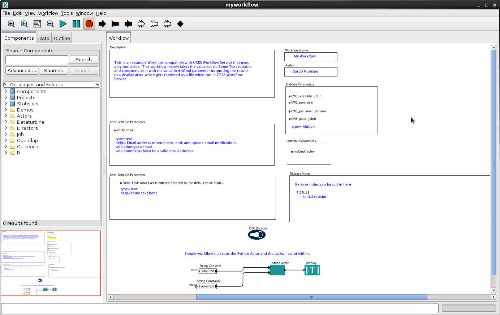
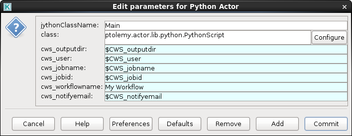
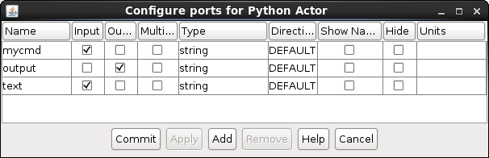

[kepler]: https://kepler-project.org/
[cookiecutter]: https://github.com/audreyr/cookiecutter
[python]: https://www.python.org/
[pythonactor]: https://kepler-project.org/developers/reference/python-and-kepler/?searchterm=token
cookiecutter-keplerpython
===========================

Cookiecutter template for a Kepler Workflow that runs a Python
script within the Python Actor. The workflow is compatible with CRBS
Workflow Service See:  https://github.com/audreyr/cookiecutter.


Usage
=====

Generate a Kepler Workflow project:

```Bash

cookiecutter https://github.com/slash-segmentation/cookiecutter-keplerpython

```

Generated Source Tree Structure
===============================

The above will create a new workflow source tree that looks like the following:

```Bash

  README.md
  src/
      (repo name).kar
  test/
       README.md
       successful_run.bats
       test_helper.bash
       bin/
           command
        
```

* src/(repo name).kar

  * This is the actual [Kepler][kepler] workflow.  The file name is set to the value set for **repo_name** when running [cookiecutter][cookiecutter] to generate the source tree. 

* test/

  * Contains bats unit test to run the [Kepler][kepler] workflow via the command line and verify correct operation.


Workflow
========

The **workflow** will look like the one in the screenshot below and include a single python actor redirected to a display actor



## Python Actor


Double clicking on the [Python Actor][pythonactor] will display [Python][python] code.  When run the [Kepler][kepler] workflow calls the **fire** method, an tiny excerpt is shown below:

```Python

# This is a simple actor that copies the input to the output.
# You can remove the ports, add new ports, and modify the script.

import ptolemy.data
import time
import os


class Main :
  """Skeleton Actor compatible with CWS"""
  def fire(self) :
    """Skeleton implementation that follows best practices for CWS"""

    .
    .
    .
    # see if mycmd input port has a token
    input_val = ''
    if self.mycmd.numberOfSources() > 0:
      input_val = self.mycmd.get(0).stringValue()
    .
    .
    .
    # fire output token
    self.output.broadcast(ptolemy.data.StringToken(input_val))

    return
.
.
.
```

When opening the actor there will be additional code, this code provides utility methods that generate files (WORKFLOW.FAILED.txt, README.txt, workflow.status) used by CRBS Workflow Service

### Python Actor parameters

The [Python Actor][pythonactor] has some parameters set within as seen in the image below (this menu can be seen by right clicking on the actor and choosing **Configure Actor**):       



The following parameters are set:

* cws_outputdir
* cws_user
* cws_jobname
* cws_jobid
* cws_workflowname
* cws_notifyemail

From within the **fire** method and **Main** class these variables are accessible by this [Python][python] code:

```python
foo = self.(parameter_name).stringValue()
```

**Example:**

```python

# gets value of cws_outputdir parameter 
foo = self.cws_outputdir.stringValue()

```

### Python Actor input/output ports

The **Python Actor** supports input and output via **Ports.** Right clicking on the **Python Actor** and clicking on **Configure Ports** will show the configured ports.  Below is a screenshot of the ports configured for the workflow generated by this template:

 

Currently there are two import ports **mycmd** and **text** and one output port **output**
Access to these can be made from within **fire** method and **Main** class via this [Python][python] code:

```python


# call self.(portname).numberOfSources() to see if there is a token to retrieve
if self.mycmd.numberOfSources() > 0:
  # self.(portname).get(#) gets the token, the .stringValue() converts it to a string
  foo = self.mycmd.get(0).stringValue()

bar = None
if self.text.numberOfSources() > 0:
  bar = self.text.get(0).stringValue()


# writing can be done via self.(portname).broadcast()
self.output.broadcast(ptolemy.data.StringToken('hello'))

```
